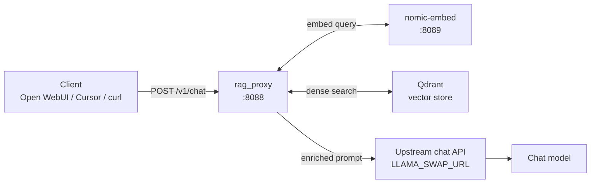
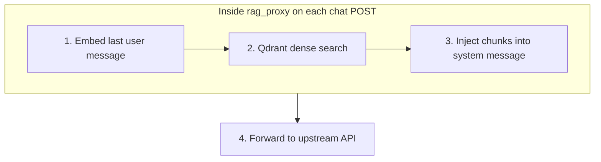
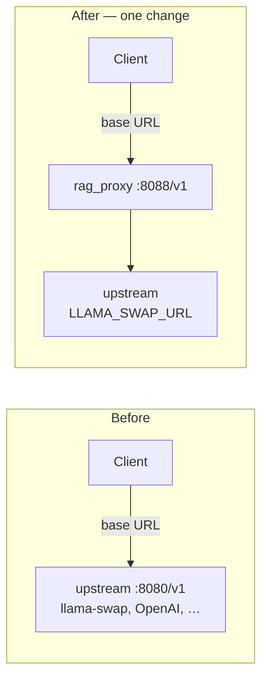

# rag_proxy

**Local knowledge, wired into every chat** — without changing your clients.

rag_proxy is a small FastAPI proxy that sits in front of **any OpenAI-compatible chat API** — [llama-swap](https://github.com/mostlygeek/llama-swap), llama-server, vLLM, OpenRouter, OpenAI, or any service that speaks `/v1/chat/completions`. Your Open WebUI, Cursor, or curl scripts keep the same API paths and keys; you only point the client base URL at rag_proxy instead of your upstream. On each chat request, the proxy can embed your question, search a Qdrant knowledge base, inject relevant chunks into the prompt, and forward the enriched request to `LLAMA_SWAP_URL`.

Transparent middleware: retrieval happens in the open, errors fail open (chat still works), and advanced stages are opt-in.

## Who this is for

- **Homelab LLM setups** — put RAG in front of your local model router or inference server and give models access to your own docs, ZIM archives, PDFs, and notes.
- **Open WebUI / Continue / Cursor users** — one base URL swap (`http://<host>:8088/v1`) adds RAG to any OpenAI-compatible client.
- **Operators who want control** — tune retrieval thresholds, roll out a tiered cognitive pipeline when you are ready, index content with rag_admin, or expose search via MCP tools.

You do **not** need a separate API key or client plugin. rag_proxy exposes the same OpenAI-compatible HTTP surface as your upstream, with optional context injection on chat `POST`s.

## How it works (default path)

With cognitive mode off (`ENABLE_COGNITIVE_PIPELINE=false`, the default), every chat request follows a simple pipeline:





Non-chat routes (`GET /v1/models`, health checks, etc.) pass through unchanged. If embed or Qdrant fails, the proxy logs a warning and still forwards the request — your chat does not break.

Optional **cognitive pipeline** adds staged retrieval (gating, hybrid BM25, rerank, graph lookup, MemGraphRAG, tools, session memory) behind per-stage `ENABLE_*` flags. See [Architecture](docs/architecture.md) and [Cognitive pipeline](docs/cognitive-pipeline.md).

## Quick start

**Prerequisites:** an OpenAI-compatible upstream (`LLAMA_SWAP_URL`), nomic-embed (`:8089`), and Qdrant with a populated collection. Homelab examples often use [llama-swap](https://github.com/mostlygeek/llama-swap) on `:8080`.

### Windows (local dev)

```powershell
python -m venv .venv
.\.venv\Scripts\activate
pip install -r requirements.txt
copy .env.example .env
# Edit .env — set QDRANT_URL and QDRANT_COLLECTION
python rag_proxy.py
```

### Linux

```bash
python3 -m venv .venv && source .venv/bin/activate
pip install -r requirements.txt
cp .env.example .env   # set QDRANT_URL and QDRANT_COLLECTION
python rag_proxy.py
```

### Point your client

Use the same paths and API key as your upstream chat API; only the client base URL changes:



```text
http://<host>:8088/v1
```

### Verify

Run the smoke checks in [Getting started — Verify the stack](docs/getting-started.md#verify-the-stack). You want a log line like `RAG: injected N chunk(s)` for a question that matches your index.

Leave `ENABLE_COGNITIVE_PIPELINE=false` until legacy RAG injects chunks reliably.

### Minimum `.env`

| Variable | Required | Typical value |
| --- | --- | --- |
| `QDRANT_URL` | Yes | `http://<qdrant-host>:6333` |
| `QDRANT_COLLECTION` | If not default | see `.env.example` |
| `LLAMA_SWAP_URL` | Yes — any OpenAI-compatible API | `http://127.0.0.1:8080` (llama-swap typical) |
| `EMBED_URL` | If not local | `http://127.0.0.1:8089` |

Full reference: [Configuration](docs/configuration.md).

## Feature highlights

| Feature | What you get |
| --- | --- |
| **Drop-in proxy** | OpenAI-compatible `/v1` API; swap base URL only |
| **Fail-open RAG** | Embed/Qdrant errors never block upstream chat |
| **Legacy mode (default)** | Embed, dense Qdrant search, inject — simple and predictable |
| **Cognitive pipeline (optional)** | Tiered stages with latency budgets and per-stage flags |
| **Hybrid retrieval** | Dense + BM25 sparse merge when sidecars are enabled |
| **rag_admin + ingest** | Web UI and worker to index ZIM/PDF/text into Qdrant |
| **MCP tools** | `search_knowledge_base` for IDE integration (`sidecars/mcp_rag/`) |
| **Observability** | Request traces, JSON logs, Prometheus `GET /metrics` |

Per-request overrides (`x-rag-mode`, `x-no-cache`, `x-conversation-id`): [Headers and clients](docs/headers-and-clients.md).

## Documentation

| Guide | Purpose |
| --- | --- |
| [docs/README.md](docs/README.md) | Full documentation index |
| [Getting started](docs/getting-started.md) | Install, verify, legacy RAG behavior |
| [Architecture](docs/architecture.md) | Components, injection, fail-open |
| [Configuration](docs/configuration.md) | All environment variables |
| [Cognitive pipeline](docs/cognitive-pipeline.md) | Stage summary and rollout |
| [COGNITIVE_RAG_PLAN.md](docs/COGNITIVE_RAG_PLAN.md) | Detailed flag matrix and failure modes |
| [Headers and clients](docs/headers-and-clients.md) | Open WebUI, Cursor, per-request headers |
| [Deployment](docs/deployment.md) | systemd, Docker |
| [Observability](docs/observability.md) | Traces, metrics, logs |
| [Troubleshooting](docs/troubleshooting.md) | Common issues |
| [Ingest and admin](docs/ingest-and-admin.md) | Content indexing UI and worker |
| [MemGraphRAG](docs/memgraphrag.md) | Graph index build and rollout |

## Deployment

**Linux systemd** (production): edit `rag-proxy.service` and `nomic-embed.service` paths, then `systemctl enable --now nomic-embed rag-proxy`. Walkthrough: [Deployment](docs/deployment.md).

**Docker** (optional bundled stack: llama-swap + optional Qdrant and cognitive sidecars):

```powershell
copy docker\.env.example docker\.env
copy docker\config.yaml.example docker\config.yaml
# Edit docker\.env and docker\config.yaml (MODELS_DIR, Qdrant, chat model)
docker compose up -d --build
```

Full stack with Qdrant and cognitive sidecars: `docker compose --profile qdrant --profile cognitive up -d --build`. Details: [docker/README.md](docker/README.md).

Default ports in homelab examples: proxy `8088`, upstream `8080`, embed `8089` — all overridable in `.env`.

## Tests

```powershell
.\scripts\run-tests.ps1
```

Or on Linux: `pip install -r requirements-dev.txt` then `pytest tests/ -q`.

Offline unit tests only — no live Qdrant or embed server required.

## License

Private.
