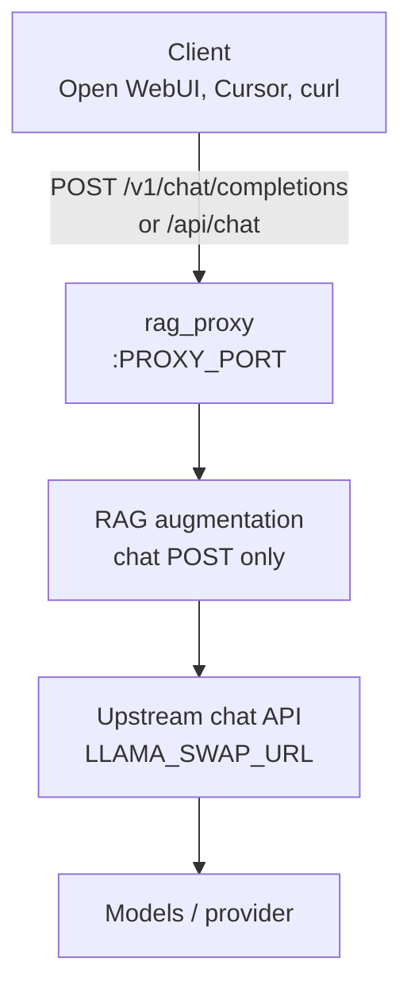
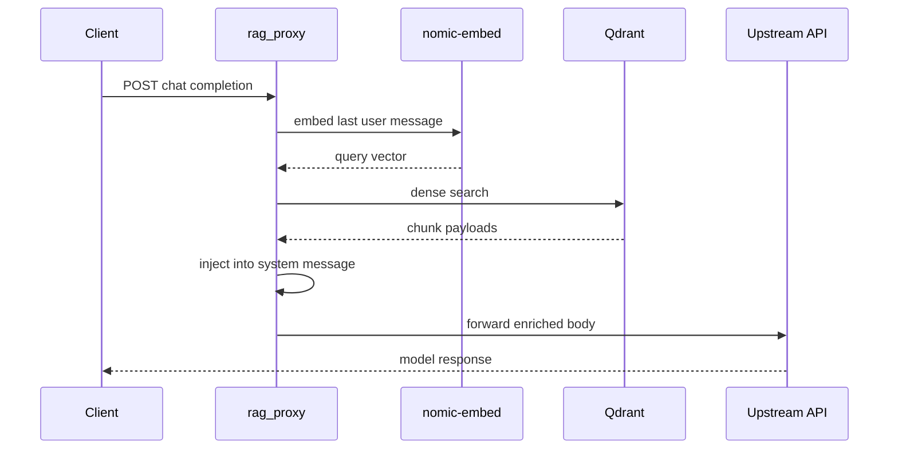
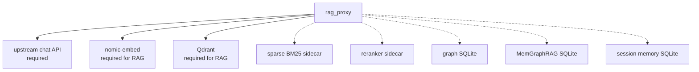
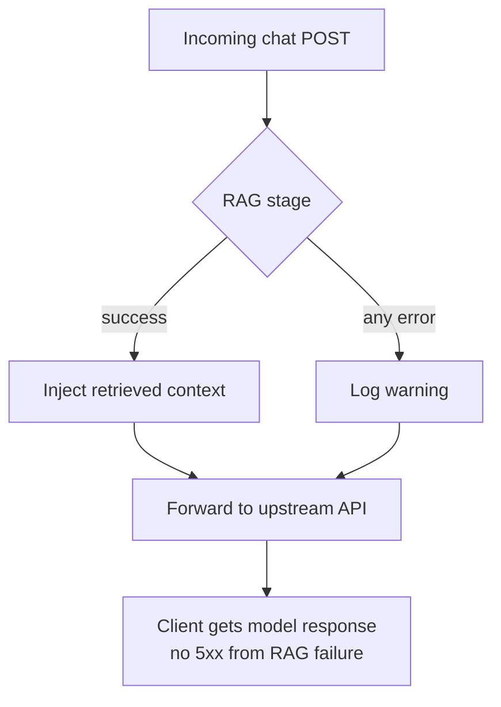

# Architecture

rag_proxy sits between OpenAI-compatible **clients** and any OpenAI-compatible **upstream chat API** (`LLAMA_SWAP_URL`). It optionally augments chat requests with retrieved knowledge, then forwards the (possibly modified) body upstream. [llama-swap](https://github.com/mostlygeek/llama-swap) is a common homelab upstream; the same proxy works with llama-server, vLLM, OpenRouter, OpenAI, and other `/v1` providers.

## Request flow



Non-chat routes (`GET /v1/models`, upstream embedding routes, health checks) are proxied without RAG modification.

## Legacy mode (default)

`ENABLE_COGNITIVE_PIPELINE=false` — every chat request with a user message runs embed → dense Qdrant search → inject.



Stages: `retrieve` → `context` (see `build_legacy_pipeline_stages()` in `pipeline_stages.py`).

## Cognitive mode (optional)

`ENABLE_COGNITIVE_PIPELINE=true` runs a tiered pipeline. Each subsystem has its own `ENABLE_*` flag. The orchestrator skips disabled stages or stages that would exceed the remaining latency budget.

```mermaid
flowchart TD
  IN([Chat POST]) --> T0

  subgraph tier0["Tier 0 — 1-15 ms"]
    T0[tier0 heuristics]
  end

  subgraph tier1["Tier 1 — 20-100 ms"]
    T0 --> intent --> gating --> routing
  end

  subgraph tier2["Tier 2 — 100-500 ms"]
    routing --> rewrite --> retrieve --> rerank
  end

  subgraph tier3["Tier 3 — 1-3 s"]
    rerank --> graph --> memgraphrag --> tools --> memory
  end

  memory --> context[context inject]
  context --> OUT[Upstream API]
```

Registered order in `pipeline_stages.py`:

`tier0` → `intent` → `gating` → `routing` → `rewrite` → `retrieve` → `rerank` → `graph` → `memgraphrag` → `tools` → `memory` → `context`

| Tier | Typical latency | Examples |
| --- | --- | --- |
| 0 | 1–15 ms | Heuristic bypass (`ENABLE_TIER0_HEURISTICS`; stage always runs, flag gates logic) |
| 1 | 20–100 ms | Intent, gating (`ENABLE_INTENT_ROUTER`, `ENABLE_RETRIEVAL_GATING`) |
| 2 | 100–500 ms | Hybrid retrieval, rerank |
| 3 | 1–3 s | Graph, MemGraphRAG, tools, rolling memory |

Retrieval skip/light/full decisions: `retrieval_policy.py`. Rollout: [Cognitive pipeline](cognitive-pipeline.md).

## Key components

| Module | Role |
| --- | --- |
| `rag_proxy.py` | Shim entrypoint and backward-compat exports |
| `rag_proxy/app.py` | FastAPI app, catch-all proxy route, `GET /metrics` |
| `rag_proxy/orchestrator.py` | Budget-aware stage loop, header parsing |
| `rag_proxy/pipeline_stages.py` | Declarative stage registry |
| `rag_proxy/retrieval_policy.py` | Tier0 bypass and gating policy |
| `rag_proxy/context.py` | `RequestContext`, pipeline enums |
| `rag_proxy/legacy_rag.py` | Embed, Qdrant, extract, inject helpers |
| `rag_proxy/config.py` | `Settings` from environment |
| `rag_proxy/upstream_client.py` | Shared httpx pool, stream relay, janitor |
| `rag_proxy/observability.py` | Trace IDs, pipeline summaries, metrics |
| `rag_proxy/stages/` | Tier 0–3 stage implementations |
| `rag_proxy/memgraphrag/` | Three-layer memory + PPR retrieval |
| `sidecars/` | CPU rerank + BM25 sparse HTTP services (Docker `cognitive` profile) |

## External dependencies

| Service | Env | When needed |
| --- | --- | --- |
| Upstream chat API | `LLAMA_SWAP_URL` | Always — any OpenAI-compatible base URL |
| nomic-embed | `EMBED_URL` | Always (for RAG) |
| Qdrant | `QDRANT_URL`, `QDRANT_COLLECTION` | Always (for RAG) |
| Sparse BM25 | `SPARSE_INDEX_URL` | `ENABLE_HYBRID_RETRIEVAL=true` |
| Reranker | `RERANKER_URL` | `ENABLE_RERANKER=true` |
| Graph SQLite | `GRAPH_DB_PATH` | `ENABLE_GRAPH_LOOKUP=true` |
| MemGraphRAG SQLite | `MEMGRAPHRAG_DB_PATH` | `ENABLE_MEMGRAPHRAG=true` — [build guide](memgraphrag.md) |
| Memory SQLite | `MEMORY_DB_PATH` | `ENABLE_ROLLING_MEMORY=true` |



If you do not own the Qdrant collection, coordinate schema and payload fields with the collection owner; rag_proxy cannot change upstream collection schema.

## Auth and passthrough

- **Auth-transparent**: API keys and `Authorization` headers pass through unchanged. The upstream validates credentials.
- **Chat paths only**: RAG runs on `POST` to `v1/chat/completions` or `api/chat` (`CHAT_PATHS` in `config.py`).
- **Streaming**: SSE from the upstream is relayed as-is. Upstream streams with no relay activity for `UPSTREAM_STREAM_ABANDON_SEC` are closed by a background janitor.

## Fail-open

Embedding, Qdrant, cognitive stage, and injection errors **never** break the upstream request. On failure:

1. A warning is logged.
2. The original request body (or last safe serialization) is forwarded to the upstream API.



Clients should not expect HTTP 5xx solely because RAG failed. Verify retrieval via logs and [Observability](observability.md).

## Context injection

Retrieved chunk text is taken from Qdrant payload fields (in order): `text`, `content`, `chunk`, `document`, `page_content`.

Chunks are prepended to the existing system message or inserted as a new system message. `TOP_K` and `SIMILARITY_THRESHOLD` control how many chunks and minimum score.

## Repository map (developer)

See [AGENTS.md](../AGENTS.md) for the full path table used by contributors and agents.
