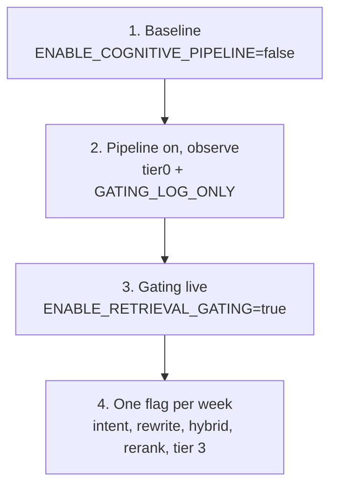

# Cognitive pipeline

Optional tiered RAG pipeline controlled by `ENABLE_COGNITIVE_PIPELINE` and per-stage `ENABLE_*` flags. Default is **off** — legacy always-retrieve behavior.

**Detailed operator reference** (step-by-step rollout, full flag matrix, failure modes): [COGNITIVE_RAG_PLAN.md](COGNITIVE_RAG_PLAN.md).

## When to enable

1. Legacy RAG works: logs show `RAG: injected N chunk(s)` for a known-good query with `ENABLE_COGNITIVE_PIPELINE=false`.
2. You want to skip retrieval for greetings/simple prompts, add hybrid search, reranking, or tier-3 features.
3. You can observe traces (`ENABLE_REQUEST_TRACE=true`) during rollout.

Do **not** enable cognitive flags until [Getting started — Verify the stack](getting-started.md#verify-the-stack) passes.

## Master switch

| Value | Behavior |
| --- | --- |
| `ENABLE_COGNITIVE_PIPELINE=false` | Legacy: always embed + dense Qdrant + inject |
| `ENABLE_COGNITIVE_PIPELINE=true` | Full stage list in `pipeline_stages.py`; each stage gated by its own flag and budget |

## Pipeline stages (summary)

```mermaid
flowchart LR
  subgraph T0["Tier 0"]
    tier0
  end
  subgraph T1["Tier 1"]
    intent --> gating --> routing
  end
  subgraph T2["Tier 2"]
    rewrite --> retrieve --> rerank
  end
  subgraph T3["Tier 3"]
    graph --> memgraphrag --> tools --> memory
  end
  tier0 --> intent
  routing --> rewrite
  rerank --> graph
  memory --> context[context]
```

| Stage | Flag | Purpose |
| --- | --- | --- |
| tier0 | `ENABLE_TIER0_HEURISTICS` | Fast regex path; may skip embed/Qdrant. Stage is always registered when cognitive pipeline is on; when the flag is false the stage no-ops except `X-RAG-Mode: off` or `force` header overrides. |
| intent | `ENABLE_INTENT_ROUTER` | Classify query intent |
| gating | `ENABLE_RETRIEVAL_GATING` | Skip/light/full retrieval |
| routing | `ENABLE_MODEL_ROUTING` | Suggest or force model by intent |
| rewrite | `ENABLE_QUERY_REWRITE` (+ optional `ENABLE_QUERY_REWRITE_LLM` + `INTENT_MODEL`) | Normalize/expand query |
| retrieve | *(always when retrieval active)* | Embed + Qdrant; hybrid when `ENABLE_HYBRID_RETRIEVAL` |
| rerank | `ENABLE_RERANKER` | Cross-encoder reorder |
| graph | `ENABLE_GRAPH_LOOKUP` | Infra graph SQLite lookup |
| memgraphrag | `ENABLE_MEMGRAPHRAG` | Fact scoring + PPR + passages |
| tools | `ENABLE_TOOLS` | Whitelisted file reads |
| memory | `ENABLE_ROLLING_MEMORY` | Session summaries (`X-Conversation-Id`) |
| context | *(always when hits exist)* | Assemble and inject; `ENABLE_TOKENIZER_ESTIMATE`, `ENABLE_SEMANTIC_DEDUPE`, `ENABLE_EMBED_CACHE` affect assembly |

Related flags not tied to a single stage: `GATING_LOG_ONLY` (gating observe-only), `ENABLE_REQUEST_TRACE` / `ENABLE_JSON_LOGS` / `ENABLE_METRICS` (observability).

**Stage registration vs flags:** `pipeline_stages.py` always registers `tier0`, `retrieve`, and `context` when the cognitive pipeline runs. Per-stage `ENABLE_*` flags (and budgets) control behavior inside the stage — e.g. `tier0` appears in traces but skips heuristics when `ENABLE_TIER0_HEURISTICS=false`.

## Recommended rollout

Do not enable everything at once. Suggested sequence:



1. **Baseline** — `ENABLE_COGNITIVE_PIPELINE=false`; confirm inject logs.
2. **Pipeline on, observe** — `ENABLE_COGNITIVE_PIPELINE=true`, `ENABLE_TIER0_HEURISTICS=true`, `GATING_LOG_ONLY=true`, `ENABLE_RETRIEVAL_GATING=false`.
3. **Gating live** — `ENABLE_RETRIEVAL_GATING=true`, `GATING_LOG_ONLY=false`; greetings should skip retrieval.
4. **One flag per week** — intent, rewrite, hybrid, reranker, tier 3 subsystems.

Full phase commands and verification table: [COGNITIVE_RAG_PLAN.md — Enabling cognitive mode](COGNITIVE_RAG_PLAN.md#enabling-cognitive-mode-step-by-step).

## Latency budgets

- `COGNITIVE_LATENCY_BUDGET_MS` (default 800): global cap. Orchestrator skips stages when remaining ms `< min_budget_ms` for that stage.
- Per-stage minimums: `STAGE_BUDGET_ROUTING_MS`, `STAGE_BUDGET_REWRITE_MS`, `STAGE_BUDGET_RETRIEVE_MS`, `STAGE_BUDGET_GRAPH_MS`, `STAGE_BUDGET_MEMGRAPHRAG_MS`.
- Rerank/tools: `RERANK_TIMEOUT_MS`, `TOOL_BUDGET_MS`.
- Priority when budget exhausted: context inject > rerank > graph > tools > LLM rewrite.

## External services (cognitive)

| Feature | Requires |
| --- | --- |
| Hybrid retrieval | `SPARSE_INDEX_URL` sidecar (Docker `cognitive` profile or `sidecars/sparse`) |
| Reranker | `RERANKER_URL` sidecar (`sidecars/rerank`, port 8095 typical) |
| Graph | `GRAPH_DB_PATH` SQLite with `entities` / `edges` |
| MemGraphRAG | `MEMGRAPHRAG_DB_PATH`; build index — see [MemGraphRAG operator guide](memgraphrag.md) |
| Rolling memory | `MEMORY_DB_PATH`; client sends `X-Conversation-Id` |
| Tools | `TOOL_ALLOWED_ROOTS` comma-separated absolute paths |

Docker service map: [docker/README.md](../docker/README.md).

## Per-request overrides

Headers on chat `POST` only — see [Headers and clients](headers-and-clients.md):

- `X-RAG-Mode: off` — skip all RAG for one request
- `X-RAG-Mode: force` — always retrieve; bypass tier0/gating skip
- `X-No-Cache: true` — bypass embed cache when `ENABLE_EMBED_CACHE=true`
- `X-Conversation-Id` — session key for rolling memory

## Reading results

Cognitive requests emit `trace=...` summary lines when `ENABLE_REQUEST_TRACE=true`. Field reference: [Observability](observability.md) and [COGNITIVE_RAG_PLAN.md — Reading logs](COGNITIVE_RAG_PLAN.md#reading-logs-and-traces).

## Model recommendations (examples)

| Role | Model |
| --- | --- |
| Intent | Qwen2.5-0.5B / Phi-3.5-mini Q4 |
| Rerank | bge-reranker-base (CPU sidecar) |
| Main chat | Your upstream stack (`LLAMA_SWAP_URL`) |

## Related configuration

All flags and defaults: [Configuration — Cognitive pipeline](configuration.md#cognitive-pipeline-master-and-stages).
