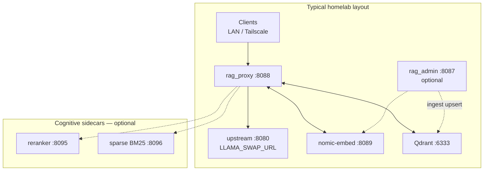

# Deployment

Production patterns for **rag_proxy** on any Linux host or via Docker. Components are node-agnostic — set URLs in `.env` to match where each service actually runs.



## Typical port layout

Default ports from `.env.example` (all overridable):

| Service | Port | Notes |
| --- | --- | --- |
| rag-proxy | `8088` | `PROXY_PORT` |
| rag-proxy (second instance) | `8087` | Side-by-side dev with `PROXY_PORT=8087` |
| Upstream chat API | `8080` | `LLAMA_SWAP_URL` (llama-swap typical) |
| nomic-embed | `8089` | `EMBED_URL` — usually localhost; not served on the proxy port |
| Qdrant | `6333` | `QDRANT_URL` — same host or remote |
| Reranker (optional) | `8095` | Cognitive sidecar |
| Sparse index (optional) | `8096` | BM25 sidecar |
| RAG admin UI (optional) | `8087` | `ADMIN_PORT` — only if `rag_admin` runs on this host |

**Port collision:** default `ADMIN_PORT` and the documented second proxy instance both use `8087`. On one host, set `ADMIN_PORT` or `PROXY_PORT` to different values before running both.

Embedding is called directly at `EMBED_URL` — not proxied through `PROXY_PORT`.

When running smoke scripts in a shell, `.env` is not auto-loaded:

```bash
set -a; . ./.env; set +a
```

## systemd (Linux)

### Unit files

Repository ships example units:

- `rag-proxy.service` — FastAPI proxy
- `nomic-embed.service` — llama-server with nomic-embed on GPU (`-ngl 99`, ~1 GiB VRAM)
- `nomic-embed@.service` — template for bulk-ingest pool (`nomic-embed@18089.service`, …)
- `nomic-embed-scale.service` — oneshot capacity plan via `scripts/scale_ingest_capacity.py --apply` (legacy wrapper `scale_nomic_embed_pool.py`)
- `nomic-embed.env.example` / `nomic-embed-scale.env.example` — copy to `/opt/ai/config/`

**Edit paths before install** — `User`, `WorkingDirectory`, `LLAMA_SERVER_BIN`, model path, and `ExecStart` are placeholders.

`rag-proxy.service` essentials — **run `bash scripts/install-systemd-units.sh`** on the host (detects repo path and venv). Example output:

```ini
WorkingDirectory=/home/kevyn/rag-proxy
EnvironmentFile=-/opt/ai/config/rag-proxy.env
ExecStart=/opt/ai/venv/bin/python rag_proxy.py
```

Raw `cp` of the repo units fails with **status=203/EXEC** when `WorkingDirectory` or `ExecStart` paths do not exist (wrong clone dir name or missing `.venv`). Use the install script or edit paths before `systemctl enable`.

### Install

```bash
sudo cp nomic-embed.service rag-proxy.service /etc/systemd/system/
sudo systemctl daemon-reload
sudo systemctl enable --now nomic-embed rag-proxy
```

### Operations

```bash
sudo systemctl status rag-proxy nomic-embed
sudo systemctl restart rag-proxy          # after .env changes
journalctl -u rag-proxy -f
```

`rag-proxy.service` starts after `nomic-embed.service` (`Wants=` / `After=`).

### Common startup failures

| Symptom | Fix |
| --- | --- |
| `status=203/EXEC` | `.venv` missing or wrong path in `ExecStart` — recreate venv at `WorkingDirectory` |
| Proxy up, never injects | Wrong `QDRANT_URL` or embed down — [Verify the stack](getting-started.md#verify-the-stack) |
| `Address already in use` | Another process on `PROXY_PORT` |

## Side-by-side prod and dev

Run one checkout on `PROXY_PORT=8088`. Clone a second checkout, set `PROXY_PORT=8087`, run manually or with a separate unit — without stopping the first instance.

## Docker

Docker Compose bundles rag-proxy with **llama-swap:cuda** as one homelab option, plus nomic-embed and optional Qdrant + cognitive sidecars. You can also run rag_proxy against any external OpenAI-compatible API by setting `LLAMA_SWAP_URL` alone.

```bash
# Legacy only
docker compose up -d --build

# Qdrant + cognitive sidecars
docker compose --profile qdrant --profile cognitive up -d --build
```

Service map, env wiring, sidecar APIs: [docker/README.md](../docker/README.md).

## Cognitive rollout

Recommended sequence after legacy RAG is stable:

1. Deploy with `ENABLE_COGNITIVE_PIPELINE=false` (no behavior change).
2. Enable pipeline + tier0 + `GATING_LOG_ONLY=true` — observe traces.
3. Enable `ENABLE_RETRIEVAL_GATING=true`, `GATING_LOG_ONLY=false`.
4. Enable one subsystem per week (intent, rewrite, hybrid, rerank, tier 3).

Details: [Cognitive pipeline](cognitive-pipeline.md) and [COGNITIVE_RAG_PLAN.md](COGNITIVE_RAG_PLAN.md).

## Production tuning (reference)

| Variable | Typical value |
| --- | --- |
| `SIMILARITY_THRESHOLD` | `0.65` |
| `TOP_K` | `5` |
| `EMBED_MAX_CHARS` | `2000` |

Align `nomic-embed.service` `-ub 2048` with embed batch limits for large inputs.

## Trust boundary

Default `PROXY_HOST=0.0.0.0` binds on all interfaces so LAN clients and Tailscale peers can reach the proxy without SSH tunnels. That is convenient for homelab use but means anyone who can reach the port can forward chat traffic to your upstream (rag_proxy does not validate upstream API keys).

Mitigations:

| Layer | Approach |
| --- | --- |
| Network | Firewall or Tailscale ACLs so only trusted hosts reach `PROXY_PORT` |
| Application | Set `PROXY_INTERNAL_TOKEN` and configure clients to send `X-Internal-Token: <value>` on every request (including `GET /metrics`) |

`PROXY_INTERNAL_TOKEN` is opt-in. When unset, behavior is unchanged. When set, missing or wrong tokens receive HTTP 401 before any upstream relay. Header details: [Headers and clients — Internal token](headers-and-clients.md#internal-token-proxy_internal_token).

### GPU embed (recommended on CUDA hosts)

Default units use **full GPU offload** (`NOMIC_GPU_LAYERS=99`). nomic-embed is small (~1 GiB VRAM per instance).

```bash
sudo cp nomic-embed.env.example /opt/ai/config/nomic-embed.env
sudo cp nomic-embed-scale.env.example /opt/ai/config/nomic-embed-scale.env
# edit LLAMA_SERVER_BIN and NOMIC_EMBED_MODEL for your host
sudo cp nomic-embed.service nomic-embed@.service nomic-embed-scale.service /etc/systemd/system/
sudo systemctl daemon-reload
sudo systemctl enable --now nomic-embed
# bulk ingest pool (optional):
sudo systemctl enable --now nomic-embed-scale.service
sudo systemctl restart rag-admin.service   # picks up INGEST_EMBED_URLS from pool env
```

Query RAG uses `:8089` (`nomic-embed.service`). Bulk ingest uses the pool on `18089+` (`nomic-embed@PORT`). With `EMBED_ON_DEMAND=true` (default on Linux), both stop and disable when idle; ingest or a RAG query starts them again automatically.

On-demand start maps `EMBED_URL` to a unit by port: only a URL on `NOMIC_QUERY_EMBED_PORT` (`:8089`) starts `nomic-embed.service`; an `EMBED_URL` on a pool port starts the matching `nomic-embed@PORT` instead. When `EMBED_URL` is not on `:8089`, `scripts/run_ingest_capacity_scale.py` skips the query-embed restart so it does not spin up an unused unit.

#### Pin embedding to a specific GPU

By default llama-server lands on the first CUDA device. On a multi-GPU host you can keep a large card free for LLM inference and run the tiny embed model on a smaller one. Set `CUDA_VISIBLE_DEVICES` in `nomic-embed.env` — it is loaded by both `nomic-embed.service` (query) and `nomic-embed@.service` (pool), so it moves **all** embedding to that card.

**Two different indexes.** `CUDA_VISIBLE_DEVICES` uses the CUDA runtime order, which frequently does **not** match `nvidia-smi`. Check the mapping first:

```bash
/opt/ai/bin/llama-server --list-devices
#   CUDA0: NVIDIA GeForce RTX 4060 ...   <- CUDA index 0
#   CUDA1: Tesla V100-SXM2-32GB ...      <- CUDA index 1  (but nvidia-smi calls this GPU 0)
```

```bash
# /opt/ai/config/nomic-embed.env  — embed on the 4060 (CUDA0 above)
NOMIC_GPU_LAYERS=99
CUDA_VISIBLE_DEVICES=0
```

Set `NOMIC_POOL_GPU_INDEX` in `nomic-embed-scale.env` to the **nvidia-smi** index of the same card (the capacity planner probes `nvidia-smi --id`, which ignores `CUDA_VISIBLE_DEVICES`). In the example above that card is `nvidia-smi` index 1, so `NOMIC_POOL_GPU_INDEX=1` while `CUDA_VISIBLE_DEVICES=0`. On a smaller card, also lower `NOMIC_POOL_VRAM_RESERVE_MIB` / `NOMIC_POOL_MAX_INSTANCES` to fit. Apply with `systemctl restart nomic-embed-scale.service nomic-embed.service`, then confirm placement with `nvidia-smi`.

> **Binary must match the GPU architecture.** llama-server only runs on CUDA archs it was compiled for (`system_info: ... CUDA : ARCHS = ...`). A V100-only build (`sm_70`) aborts with `ggml-cuda.cu: CUDA error` on an Ada card like the RTX 4060 (`sm_89`). Rebuild with the target arch included, e.g. `cmake -B build -DCMAKE_CUDA_ARCHITECTURES="70;89"` (verify with `llama-server --list-devices`).

On `/opt/ai` hosts, `scripts/update-buster-embed-gpu.sh` pulls the repo, installs nomic-embed units and scale env, starts the GPU pool, and smoke-checks `:8089` (override `REPO_ROOT` / `CONFIG_DIR` as needed).

## Optional admin / ingest

`rag_admin` and the ingest worker are separate from the proxy — same machine or another host. See [Ingest and admin](ingest-and-admin.md). Example unit: `rag-admin.service` in the repo root.

## Dev / host-specific scripts

Internal homelab helpers — see [scripts/README.md](../scripts/README.md#dev--homelab-scripts).

## Config changes

No hot reload — edit `.env` or systemd `EnvironmentFile` and restart:

```bash
sudo systemctl restart rag-proxy
```

Per-request overrides without restart: [Headers and clients](headers-and-clients.md).
