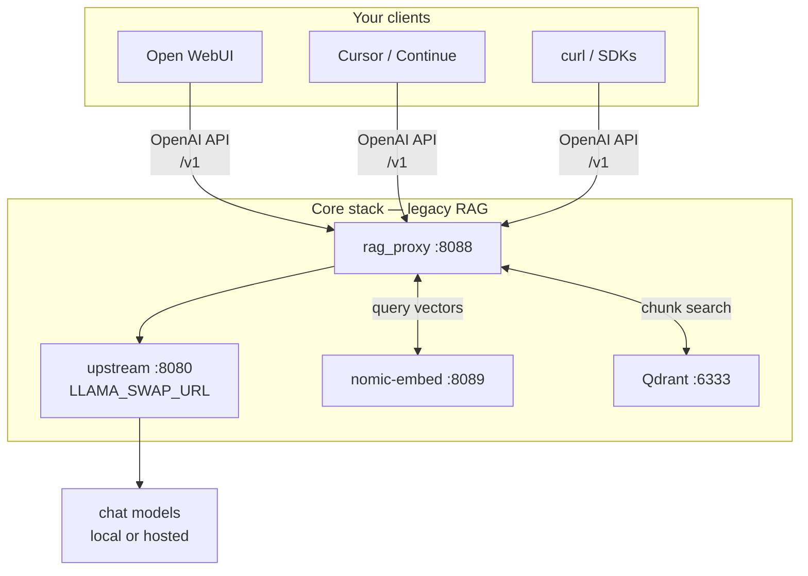
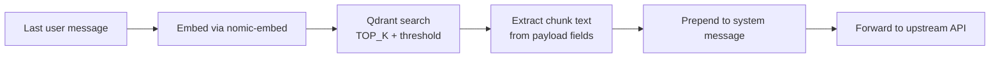

# Getting started

Install rag_proxy, configure `.env`, run the proxy, and confirm RAG injection works before enabling cognitive features.

## Prerequisites

| Service | Role | Default URL |
| --- | --- | --- |
| Upstream chat API | Any OpenAI-compatible provider (`LLAMA_SWAP_URL`) | `http://127.0.0.1:8080` — [llama-swap](https://github.com/mostlygeek/llama-swap) is typical locally; OpenRouter, OpenAI, vLLM, and llama-server also work |
| nomic-embed | Query embeddings (`llama-server --embedding`) | `http://127.0.0.1:8089` |
| Qdrant | Vector store | set `QDRANT_URL` in `.env` |

Optional (cognitive mode): sparse BM25 sidecar (`SPARSE_INDEX_URL`), reranker (`RERANKER_URL`). See [Configuration](configuration.md) and [docker/README.md](../docker/README.md).



## Install

### Linux

```bash
cd rag_proxy
python3 -m venv .venv
source .venv/bin/activate
pip install -r requirements.txt
cp .env.example .env
$EDITOR .env   # set QDRANT_URL and QDRANT_COLLECTION
python rag_proxy.py
```

Alternative entrypoint: `python -m rag_proxy`.

### Windows (local dev)

```powershell
python -m venv .venv
.\.venv\Scripts\activate
pip install -r requirements.txt
copy .env.example .env
# Edit .env — set QDRANT_URL and QDRANT_COLLECTION
python rag_proxy.py
```

Production deploy targets Linux systemd. See [Deployment](deployment.md).

### Docker

For an optional **Docker homelab stack** (llama-swap:cuda bundled) with Qdrant + cognitive sidecars:

```bash
cp docker/.env.example docker/.env
cp docker/config.yaml.example docker/config.yaml
docker compose up -d --build
```

Full stack profile: [docker/README.md](../docker/README.md).

## Configure `.env`

Minimum checklist:

| Variable | You must set | Typical value |
| --- | --- | --- |
| `QDRANT_URL` | Yes | `http://<qdrant-host>:6333` |
| `QDRANT_COLLECTION` | If not default | value from `.env.example` |
| `LLAMA_SWAP_URL` | Yes — OpenAI-compatible upstream | `http://127.0.0.1:8080` (llama-swap typical) |
| `EMBED_URL` | If embed server is not local | `http://127.0.0.1:8089` |

Leave `ENABLE_COGNITIVE_PIPELINE=false` until legacy RAG injects chunks reliably. All other variables have safe defaults in [.env.example](../.env.example). Full reference: [Configuration](configuration.md).

Startup logs list embed URL, Qdrant URL/collection, and whether cognitive mode is enabled.

## Point your client

Use the **same paths and API key** as your upstream; only the client base URL changes to `http://<host>:8088/v1`.

| Client | Setting |
| --- | --- |
| Open WebUI | Settings → Connections → OpenAI API → URL |
| Continue / Cursor | OpenAI base URL override |
| curl / scripts | `POST http://<host>:8088/v1/chat/completions` |

Details and per-request headers: [Headers and clients](headers-and-clients.md).

## Verify the stack

Replace host/ports with your `.env` values. Expect JSON responses; errors usually mean a service is down or the URL is wrong.

```bash
# 1. Embed server (must return embedding vector)
curl -s -X POST "http://127.0.0.1:8089/v1/embeddings" \
  -H "Content-Type: application/json" \
  -d '{"model":"nomic-embed-text-v1.5","input":"test query"}'

# 2. Qdrant collection exists
curl -s "http://127.0.0.1:6333/collections/$QDRANT_COLLECTION"

# 3. Proxy forwards to upstream (no RAG required)
curl -s "http://127.0.0.1:8088/v1/models"

# 4. RAG path — question that should match your knowledge base
curl -s -X POST "http://127.0.0.1:8088/v1/chat/completions" \
  -H "Content-Type: application/json" \
  -H "Authorization: Bearer YOUR_KEY" \
  -d '{"model":"your-model","messages":[{"role":"user","content":"question about your indexed docs"}],"stream":false}'
```

### Success signals in proxy logs

With `LOG_LEVEL=INFO`:

| Log line | Meaning |
| --- | --- |
| `RAG: injected N chunk(s) (scores: ...)` | Retrieval worked; context added to system message |
| `RAG: no chunks above threshold=...` | Search ran but nothing scored high enough; lower `SIMILARITY_THRESHOLD` or rephrase |
| `QDRANT_URL still has placeholder` | Fix `.env` before expecting retrieval |

For cognitive mode, look for `trace=...` lines — [Observability](observability.md).

## Legacy RAG behavior

On chat `POST` requests (when cognitive mode is off):



1. Last user message text is embedded via `nomic-embed-text-v1.5`.
2. Qdrant vector search returns up to `TOP_K` hits above `SIMILARITY_THRESHOLD`.
3. Chunk text from payload fields: `text`, `content`, `chunk`, `document`, `page_content`.
4. Chunks prepended to the system message (or a new system message is inserted).

Embedding inputs are tail-truncated to `EMBED_MAX_CHARS` (default 2000). On batch overflow, retry at 1200 chars.

## Tests

```powershell
.\scripts\run-tests.ps1
```

Or on Linux:

```bash
pip install -r requirements-dev.txt
pytest tests/ -q
```

Offline unit tests only — no live Qdrant or embed server required.

## Next steps

- Enable cognitive features gradually: [Cognitive pipeline](cognitive-pipeline.md) and [COGNITIVE_RAG_PLAN.md](COGNITIVE_RAG_PLAN.md)
- Production deploy: [Deployment](deployment.md)
- Index new content: [Ingest and admin](ingest-and-admin.md)
