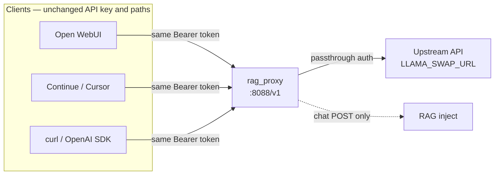

# Headers and clients

rag_proxy is a drop-in OpenAI-compatible proxy. Clients use the same API paths and credentials as your **upstream chat API**; only the **client base URL** changes to rag_proxy.



## Base URL

Point clients at:

```text
http://<host>:<PROXY_PORT>/v1
```

Default `PROXY_PORT` is `8088`. Run a second instance on another port (e.g. `8087`) for side-by-side dev.

| Client | Where to set |
| --- | --- |
| Open WebUI | Settings → Connections → OpenAI API → URL |
| Continue | `openai.apiBase` or provider base URL |
| Cursor | OpenAI base URL override in model settings |
| curl / SDKs | `base_url` / `OPENAI_BASE_URL` |

Example chat request:

```bash
curl -s -X POST "http://127.0.0.1:8088/v1/chat/completions" \
  -H "Content-Type: application/json" \
  -H "Authorization: Bearer YOUR_KEY" \
  -d '{"model":"your-model","messages":[{"role":"user","content":"hello"}],"stream":false}'
```

Use the same `Authorization` header (or lack thereof) that works against your upstream (`LLAMA_SWAP_URL`) directly.

## Internal token (`PROXY_INTERNAL_TOKEN`)

Optional shared secret when the proxy listens on `0.0.0.0` (LAN or Tailscale). When `PROXY_INTERNAL_TOKEN` is set in `.env`, every request to the proxy — including passthrough routes and `GET /metrics` — must include:

| Header | Value |
| --- | --- |
| `X-Internal-Token` | Same string as `PROXY_INTERNAL_TOKEN` |

When the env var is empty (default), the header is not required and behavior is unchanged.

Example with token:

```bash
curl -s -X POST "http://127.0.0.1:8088/v1/chat/completions" \
  -H "Content-Type: application/json" \
  -H "Authorization: Bearer YOUR_KEY" \
  -H "X-Internal-Token: YOUR_PROXY_TOKEN" \
  -d '{"model":"your-model","messages":[{"role":"user","content":"hello"}],"stream":false}'
```

Open WebUI and other clients may not support custom headers on the connection profile — prefer network ACLs or a reverse proxy in that case. See [Deployment — Trust boundary](deployment.md#trust-boundary).

## Which routes get RAG

| Method | Path | RAG |
| --- | --- | --- |
| `POST` | `/v1/chat/completions` | Yes |
| `POST` | `/api/chat` | Yes |
| * | `/v1/models`, `/v1/embeddings`, health, etc. | No — passthrough |

Streaming (`"stream": true`) is supported; the proxy relays SSE from the upstream unchanged.

## Per-request headers (cognitive mode)

Send on chat `POST` requests only. Header names are case-insensitive.

| Header | Values | Effect |
| --- | --- | --- |
| `X-RAG-Mode` | `off` | Skip all RAG for this request |
| `X-RAG-Mode` | `force` | Always retrieve; bypass tier0/gating skip |
| `X-RAG-Mode` | `auto` | Default pipeline behavior (omit header = auto) |
| `X-No-Cache` | `true` | Bypass embed cache when `ENABLE_EMBED_CACHE=true` |
| `X-Conversation-Id` | string | Session key for rolling memory when `ENABLE_ROLLING_MEMORY=true` |
| `X-Capture-Log` | `true` | Opt in to transcript capture when `ENABLE_TRANSCRIPT_CAPTURE=true` and `TRANSCRIPT_HEADER_OPT_IN=true` |

Parsed in `orchestrator.py` from incoming request headers and forwarded upstream as-is (except host/connection stripping). Transcript capture is evaluated in `app.py` from the same headers (`capture_enabled` in `capture.py`).

### Force retrieval (one shot)

Useful for debugging gating or testing a greeting that would normally skip RAG:

```bash
curl -s -X POST "http://127.0.0.1:8088/v1/chat/completions" \
  -H "Content-Type: application/json" \
  -H "Authorization: Bearer YOUR_KEY" \
  -H "X-RAG-Mode: force" \
  -d '{"model":"your-model","messages":[{"role":"user","content":"hello"}],"stream":false}'
```

### Skip RAG (meta prompts)

Open WebUI follow-up / `### Task:` style prompts are skipped by design in some paths. To explicitly skip:

```bash
curl -s -X POST "http://127.0.0.1:8088/v1/chat/completions" \
  -H "Content-Type: application/json" \
  -H "X-RAG-Mode: off" \
  -d '{"model":"your-model","messages":[{"role":"user","content":"### Task: suggest follow-ups"}],"stream":false}'
```

### Rolling memory session

When `ENABLE_ROLLING_MEMORY=true`, send a stable id per conversation:

```bash
-H "X-Conversation-Id: session-abc-123"
```

### Transcript capture opt-in

When `ENABLE_TRANSCRIPT_CAPTURE=true` and `TRANSCRIPT_HEADER_OPT_IN=true`, only requests with the header are captured (subject to `TRANSCRIPT_SAMPLE_RATE`):

```bash
-H "X-Capture-Log: true"
```

When `TRANSCRIPT_HEADER_OPT_IN=false` (default), capture does not require this header. See [Configuration — Transcript capture](configuration.md#transcript-capture).

## Legacy mode headers

With `ENABLE_COGNITIVE_PIPELINE=false`, `X-RAG-Mode: off` and `force` still apply where implemented in the orchestrator; tier0/gating are not active. `X-Conversation-Id` has no effect unless rolling memory is enabled.

## Auth

rag_proxy does not validate API keys. Headers pass through to the upstream. If auth fails, test the same request against `LLAMA_SWAP_URL` directly.

## Troubleshooting client issues

| Symptom | Check |
| --- | --- |
| 404 on `/v1` | Base URL must include `/v1` suffix for OpenAI clients |
| Works on `:8080`, fails on `:8088` | Proxy down or wrong port; `curl http://host:8088/v1/models` |
| No RAG in UI but curl works | UI may use a different connection URL or cached settings |
| Streaming broken | Test same stream against upstream (`LLAMA_SWAP_URL`); proxy relays SSE as-is |

More: [Troubleshooting](troubleshooting.md).
