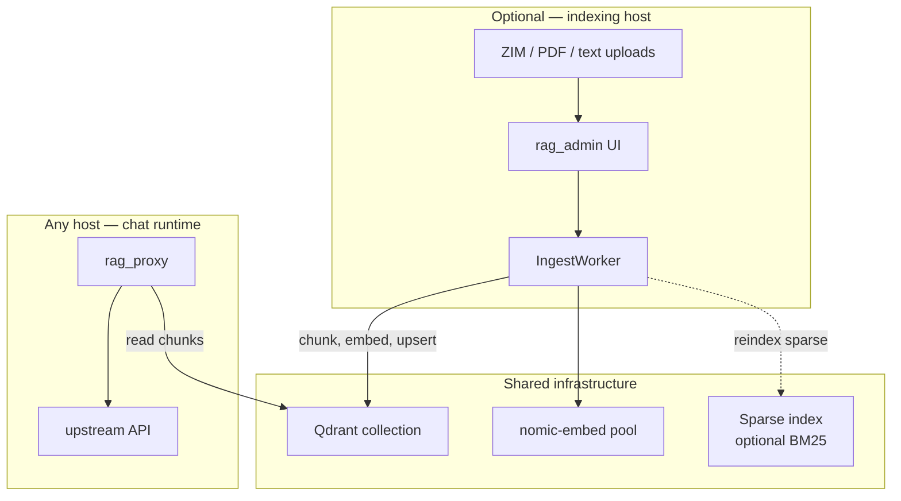

# Ingest and admin

Optional content management stack for indexing ZIM archives, PDFs, and text into Qdrant. Separate from the core proxy — you can run `rag_proxy` against an existing Qdrant collection without ever running admin/ingest.

## Deployment topology

| Component | Typical placement |
| --- | --- |
| `rag_proxy` | Any host with network access to Qdrant, embed, and the upstream chat API (`LLAMA_SWAP_URL`) |
| `rag_admin` + ingest | Optional; same host or a dedicated indexing machine |

Admin upserts vectors to Qdrant; the proxy reads the same `QDRANT_URL` / `QDRANT_COLLECTION`. Nothing requires co-location — only reachable URLs and paths matter.



This repository ships `rag-proxy.service`, `rag-admin.service`, `nomic-embed.service`, `nomic-embed@.service`, and `nomic-embed-scale.service` examples. Edit paths and `User=` before install. Cron helpers load admin env via `RAG_ADMIN_ENV_FILE` (default `/opt/ai/config/rag-admin.env`); `catalog_weekly_update.py` also accepts legacy alias `RAG_ADMIN_ENV`.

## Components

| Component | Path | Role |
| --- | --- | --- |
| RAG admin UI | `rag_admin/` | Web UI: catalog, uploads, job queue, content explorer |
| Ingest worker | `ingest/` | Background worker: chunk, embed, upsert to Qdrant |
| Offline MemGraphRAG index | `scripts/build_memgraphrag_index.py` | Build MemGraphRAG SQLite from chunks |

Admin embeds the ingest worker in-process (`IngestWorker` started from `rag_admin/app.py` lifespan).

## RAG admin UI

### Run

```bash
# From repo root with shared .env
python -m rag_admin
```

Uses uvicorn; bind and paths from environment (see below).

### Features

- Dashboard and ingest job status
- ZIM catalog subscriptions and downloads
- PDF/text upload queue
- Content explorer for indexed material
- arXiv and archive catalog providers (`rag_admin/catalog/`)
- **Settings** (`/settings`) — persist ingest, proxy, cognitive, MemGraphRAG, and observability knobs to env files (see below)

### Settings UI

The admin UI writes overrides to env files on disk — it does **not** hot-reload `rag_proxy` in memory. After saving proxy or cognitive groups, restart the proxy (or use **Restart proxy** when `RAG_PROXY_RESTART_CMD` is set).

| Tab | Env file target | Hot-reload in admin |
| --- | --- | --- |
| Dense ingest & BM25 | `RAG_ADMIN_ENV_FILE` | Yes — ingest worker picks up batch size, pool URLs, pause |
| Proxy RAG retrieval | `RAG_PROXY_ENV_FILE` | No — restart proxy |
| Cognitive pipeline | `RAG_PROXY_ENV_FILE` | No — restart proxy |
| MemGraphRAG runtime | `RAG_PROXY_ENV_FILE` | No — restart proxy |
| MemGraphRAG index build | admin SQLite + env fallback | Build jobs via **Start build** |
| Logging & metrics | `RAG_PROXY_ENV_FILE` | No — restart proxy |

Paths default to `/opt/ai/config/rag-admin.env` and `/opt/ai/config/rag-proxy.env` (`RAG_ADMIN_ENV_FILE`, `RAG_PROXY_ENV_FILE`). Shared keys on the ingest tab (`EMBED_URL`, `QDRANT_URL`, `QDRANT_COLLECTION`, `SPARSE_INDEX_URL`) are mirrored into both files.

**Env-only (not in Settings UI):** `UPSTREAM_*`, model registry JSON, transcript capture (except `ENABLE_TRANSCRIPT_CAPTURE`), and most latency-budget knobs — set in env and restart. Chunk size changes require `python scripts/requeue_all_ingest.py` for existing files.

**Port topology:** Settings defaults **Primary embed URL** to `http://127.0.0.1:8089` (query RAG; mirrored to `rag-proxy.env`). Bulk GPU ingest uses **Ingest embed pool URLs** on ports `18089+` (`INGEST_EMBED_URLS`); the capacity planner writes those via `scripts/scale_ingest_capacity.py` (legacy wrapper `scale_nomic_embed_pool.py`).

Status API: `GET /api/settings/status` (service reachability for the Settings page).

### Security

Startup **refuses** default `ADMIN_SESSION_SECRET` and `ADMIN_PASSWORD` unless `ADMIN_ALLOW_INSECURE_DEFAULTS=true` (local dev only). Set strong secrets before exposing beyond localhost.

Default bind: `127.0.0.1:8087`. Primary embed defaults to `:8089`; set **Ingest embed pool URLs** for bulk pool hosts (`18089+`).

## Environment variables

Proxy and admin share many vars (`EMBED_URL`, `QDRANT_URL`, `QDRANT_COLLECTION`). When unset, defaults differ: `rag_proxy/config.py` uses `QDRANT_URL=http://192.168.1.36:6333`; `rag_admin/config.py` uses `http://127.0.0.1:6333`. Set explicitly in `.env` for both services.

Admin-specific (from `.env.example` comments and `rag_admin/config.py`):

| Variable | Default | Purpose |
| --- | --- | --- |
| `ADMIN_HOST` | `127.0.0.1` | UI bind address |
| `ADMIN_PORT` | `8087` | UI port |
| `ADMIN_DB_PATH` | `/opt/ai/rag/admin.sqlite` | Job/catalog SQLite |
| `ZIM_DIR` | `/opt/ai/rag/zim` | Downloaded ZIM files |
| `UPLOAD_DIR` | `/opt/ai/rag/uploads` | Uploaded PDFs/text |
| `ADMIN_SESSION_SECRET` | *(required)* | Session cookie signing |
| `ADMIN_PASSWORD` | *(required)* | Login password |
| `ADMIN_ALLOW_INSECURE_DEFAULTS` | — | `true` for local dev only |
| `INGEST_BATCH_SIZE` | `64` | Texts per embed HTTP request / Qdrant upsert batch |
| `INGEST_EMBED_CONCURRENCY` | `4` | Concurrent in-flight embed batches (auto-set when using VRAM pool) |
| `INGEST_EMBED_URLS` | — | Comma-separated embed endpoints for ingest round-robin (generated pool file) |
| `INGEST_MAX_ARTICLES` | `0` | ZIM article limit (`0` = unlimited) |
| `INGEST_SPARSE_REINDEX` | `idle` | When to trigger sparse sidecar reindex |
| `INGEST_STALL_MINUTES` | `15` | Mark jobs stalled after no progress |
| `RAG_PROXY_URL` | `http://127.0.0.1:8081` | Optional proxy URL for admin smoke hooks |

Full list: [Configuration — RAG admin and ingest](configuration.md#rag-admin-and-ingest-optional).

## Ingest pipeline

1. **Queue** — jobs created from UI (ZIM path, upload, catalog subscription).
2. **Read** — ZIM (`ingest/zim_reader.py`), PDF (`ingest/pdf_reader.py`), or plain text.
3. **Chunk** — `ingest/chunking_strategy.py` picks a Chonkie strategy per document; `ingest/chunking.py` loads token size/overlap from env and runs the chunker with strategy-specific fallbacks. Default **512 tokens / 64 overlap** (~12.5%) using the nomic-embed tokenizer when available.
4. **Embed** — `ingest/embedder.py` calls `EMBED_URL` (same nomic-embed as proxy).
5. **Write** — `ingest/qdrant_writer.py` upserts to `QDRANT_COLLECTION`.
6. **Sparse reindex** — optional POST to `SPARSE_INDEX_URL` when `INGEST_SPARSE_REINDEX` triggers (hybrid cognitive mode).

### Chunk strategy selection

| Strategy | When | Typical sources |
| --- | --- | --- |
| `recursive` | Markdown structure (headers, frontmatter, tables) | `.md`, fleet docs, schema nodes |
| `sentence` | Flowing prose without reliable formatting | ZIM articles, plain PDFs, narrative `.txt` |
| `semantic` | Dense technical writing where topics do not follow layout | arXiv PDFs, academic papers (requires `chonkie[semantic]`) |
| `token` | Unstructured scrapes / OCR dumps | Long single-line text, weak paragraph breaks |
| `code` | Source-heavy content | Scripts, playbooks (requires `chonkie[code]`) |

**Evaluation order** (`select_chunk_strategy` in `ingest/chunking_strategy.py`) — first match wins:

1. `code` — fenced blocks or >=25% code-like lines in the first 120 lines
2. `token` — unstructured/OCR dumps (long lines, few paragraph breaks)
3. `recursive` — `.md` suffix or markdown structure (headers, frontmatter, tables) on any file type
4. `semantic` — arXiv path/stem or >=2 academic markers in the first 4k chars (when `INGEST_CHUNK_SEMANTIC=true`)
5. `sentence` — `file_type` is `pdf`, then `zim`, then `text`
6. `recursive` — default

Code-heavy academic PDFs can match step 1 before step 4; they will not use semantic chunking unless code detection fails.

On failure or empty output, each primary strategy walks its own fallback chain (`ingest/chunking.py`):

| Primary | Fallback chain |
| --- | --- |
| `semantic` | `sentence` → `recursive` → `token` |
| `code` | `recursive` → `token` |
| `sentence` | `recursive` → `token` |
| `recursive` | `sentence` → `token` |
| `token` | `recursive` |

Tokenizer resolution tries `INGEST_CHUNK_TOKENIZER` (default `nomic-ai/nomic-embed-text-v1.5`), then `gpt2`, then `word`. On startup, rag-admin logs **`ingest chunking ready`** with the active tokenizer; a **`FALLBACK`** warning means chunk sizes may not match nomic-embed. Set `INGEST_CHUNK_SEMANTIC=false` to skip semantic selection even when `chonkie[semantic]` is installed.

The `token` strategy (scraped/unstructured text) strips cookie banners and nav fluff before chunking. Semantic chunks log a distribution summary; adjacent pieces below `INGEST_CHUNK_MIN_TOKENS` are merged before embed.

Optional Chonkie extras (after `pip install -r requirements-admin.txt`):

```bash
pip install 'chonkie[semantic]'   # semantic strategy (arXiv / dense PDFs)
pip install 'chonkie[code]'       # code strategy; otherwise falls back to recursive
```

| Variable | Default | Purpose |
| --- | --- | --- |
| `INGEST_CHUNK_SIZE_TOKENS` | `512` | Target chunk size (nomic-embed sweet spot) |
| `INGEST_CHUNK_OVERLAP_TOKENS` | `64` | Overlap (~12.5%; use 50-100 for 512-token chunks) |
| `INGEST_CHUNK_TOKENIZER` | `nomic-ai/nomic-embed-text-v1.5` | Tokenizer aligned with embed model |
| `INGEST_CHUNK_SEMANTIC` | `true` | Enable semantic strategy when deps installed |
| `INGEST_CHUNK_SEMANTIC_MODEL` | `minishlab/potion-base-32M` | Local model for semantic boundary detection |
| `INGEST_CHUNK_MIN_TOKENS` | `100` | Merge adjacent undersized chunks before embed |

Bulk ZIM ingest uses `ingest/pipeline.py`: multiple embed batches run concurrently (`INGEST_EMBED_CONCURRENCY`) while Qdrant upserts stay in chunk order. Set `llama-server --parallel` on the embed endpoint to at least the same value (e.g. `16` on a dedicated nomic-embed GPU). Smaller `INGEST_BATCH_SIZE` (e.g. `32`) with higher concurrency often beats one huge batch per request.

Chunking defaults to **512 tokens** with **64-token overlap** so each chunk fits nomic-embed-text-v1.5's effective range without diluting the vector. The embedder still bisects batches on `exceed_context_size` responses.

### Ingest capacity planner (multi-resource auto-scale)

For bulk ingest on a GPU host, run several `llama-server` embed instances (systemd template `nomic-embed@PORT.service`) and round-robin across them via `INGEST_EMBED_URLS`.

`scripts/scale_ingest_capacity.py` (legacy entry point `scale_nomic_embed_pool.py`) probes the host — free VRAM plus CPU cores, available RAM, and disk speed — and plans the whole ingest stack. GPU pool sizing is unchanged:

```text
instances = clamp((gpu_free_mib - NOMIC_POOL_VRAM_RESERVE_MIB) / NOMIC_POOL_VRAM_PER_INSTANCE_MIB)
```

On top of that it computes `INGEST_FILE_CONCURRENCY`, `INGEST_BATCH_SIZE`, `INGEST_CHUNK_CONCURRENCY`, semantic chunking on/off, and `NOMIC_POOL_PARALLEL` (capped for low-bandwidth GPUs), and writes everything to `/opt/ai/config/nomic-embed-pool.env` with a rationale comment per decision. Tune via `/opt/ai/config/nomic-embed-scale.env` (see `nomic-embed-scale.env.example`) and `INGEST_CAPACITY_*` caps ([Configuration](configuration.md)). Full reference: [Ingest capacity planning](ingest-capacity-planning.md).

```bash
# Dry-run plan
python scripts/scale_ingest_capacity.py

# Apply via systemd (recommended on boot)
sudo systemctl restart nomic-embed-scale.service
systemctl restart rag-admin.service
```

The **Scale ingest capacity** button on the Settings ingest tab pauses ingest, waits for in-flight files to finish, then runs `scripts/run_ingest_capacity_scale.py` as a background job (chunk + embed benchmarks, apply pool plan, restore query embed on `:8089`). Measured `chunks/min` from bench JSON drives chunk concurrency, embed concurrency, and batch size; VRAM probes still size the pool. On success it syncs the resulting `INGEST_*` keys into the admin env, hot-reloads the worker, restores the prior pause state, and re-queues all files only if the plan changed semantic chunking.

Without `nvidia-smi`, the planner falls back to a single port (`NOMIC_POOL_PORT_BASE`) and skips systemd changes; missing CPU/RAM/disk probes simply skip those caps. The embedder fails over to alternate pool URLs on HTTP 404/5xx.

Payload fields written for proxy retrieval: `text`, `content`, `chunk`, `document`, `page_content` (proxy checks in that order).

### Stall detection

`ingest/stall.py` marks long-idle jobs using `INGEST_STALL_MINUTES`. The Jobs page auto-refreshes while files are pending or running and shows embed rate (chunks/min).

### Tuning bulk ingest throughput

| Lever | Variable | Notes |
| --- | --- | --- |
| Parallel files | `INGEST_FILE_CONCURRENCY` | Default `max(1, min(4, embed pool size))`; hot-reloads when the worker is running |
| Parallel chunking | `INGEST_CHUNK_CONCURRENCY` | Default `min(4, cores / 2)`; concurrent chunk executions |
| Batch size | `INGEST_BATCH_SIZE` | Raise (e.g. `256`) when embed server supports large batches |
| Parallel embeds | `INGEST_EMBED_CONCURRENCY` | Default `4`; raise if embed server keeps up |
| GPU embed | `nomic-embed` `-ngl 99` | Default in shipped units; see [Deployment](deployment.md) |
| Sparse rebuild | `INGEST_SPARSE_REINDEX=off` | Disable during bulk; reindex once at end |

The capacity planner sets all of these automatically from the host profile; manual overrides still work. Effective values appear read-only on the Dashboard and Jobs pages.

## Qdrant ownership

If you do not control the Qdrant collection schema, coordinate index params and payload fields with the collection owner. rag_proxy and ingest can upsert points but cannot change upstream schema.

## MemGraphRAG

MemGraphRAG builds a separate SQLite graph index from your Qdrant chunks (or text files). It is not part of the ingest worker — run the offline build after content is in Qdrant.

Full operator guide: [MemGraphRAG](memgraphrag.md).

## Re-chunk after strategy or size change

After changing `INGEST_CHUNK_*` vars or upgrading chunking logic, re-index all tracked files:

```bash
python scripts/requeue_all_ingest.py
```

Loads `RAG_ADMIN_ENV_FILE` (default `/opt/ai/config/rag-admin.env`). For each on-disk file in admin SQLite, deletes existing Qdrant points for that source and resets chunk progress to `pending`. Run with `rag_admin` (ingest worker) active so the queue is processed; missing files on disk are skipped.

## Catalog weekly updates

Cron helper for subscription update checks:

```bash
python scripts/catalog_weekly_update.py
```

## MCP retrieval tools

`sidecars/mcp_rag/` exposes MCP tools (e.g. `search_knowledge_base`) over the hybrid stack for IDE integration — separate from the HTTP proxy path.

## Related docs

- Proxy retrieval behavior: [Architecture](architecture.md)
- Hybrid/sparse sidecar: [docker/README.md](../docker/README.md)
- Verify indexed content reaches chat: [Getting started — Verify the stack](getting-started.md#verify-the-stack)
